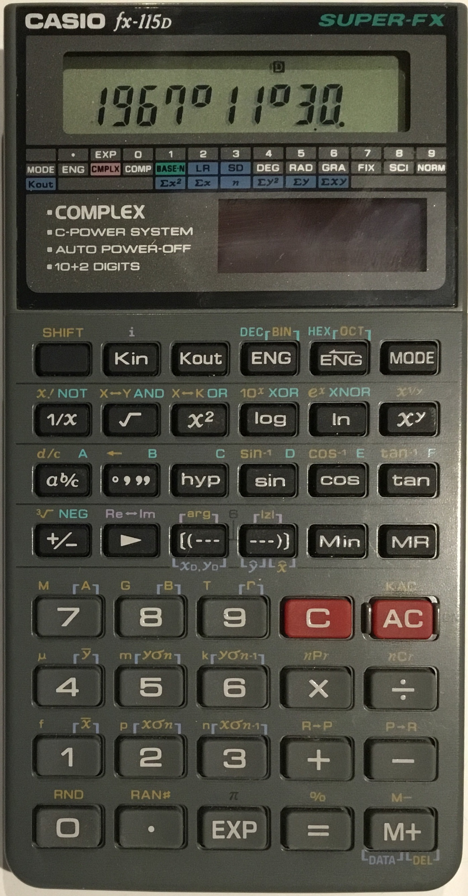
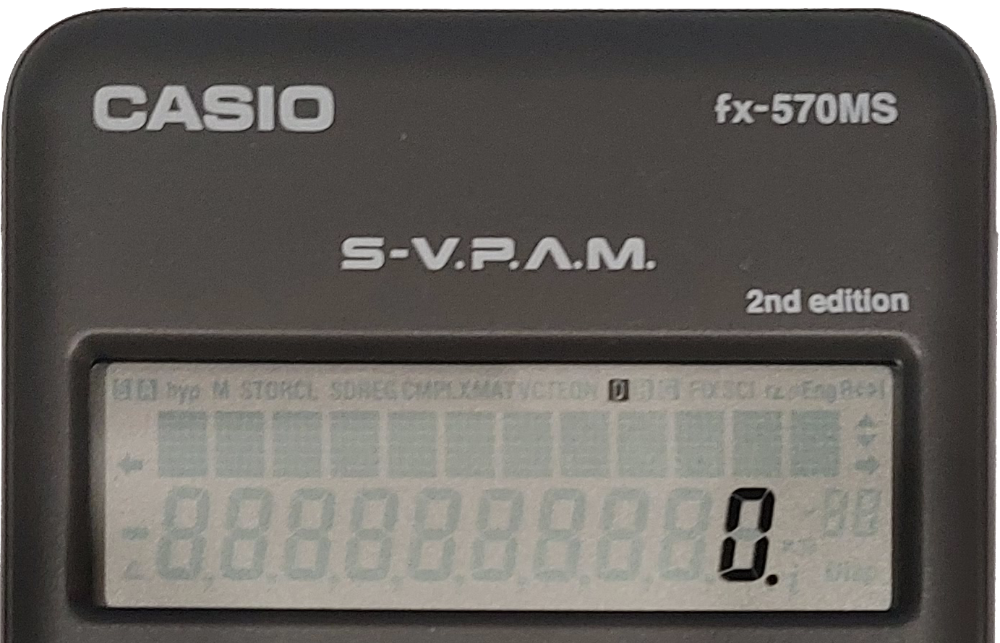

# AES Calculator (C# Winform Application)

This calculator application simulates the operation of an AES (Algebraic Entry System) calculator.  
These calculators execute binary operations as soon as the next operator is pressed, and are hence also known as immediate execution calculators.  
This also means that the order of operations is not taken into account.  
The application's design was inspired by old Casio calculators, giving it a unique look.

## Keyboard Controls

### Numbers and standard operations
- Full number pad support
- Keyboard digit row for numbers
- **\+** : `⇧ Shift` + `=`
- **−** : `-` 
- **×** : `⇧ Shift` + `8`
- **÷ (% in Shift mode)** : `/`
- **=** : `⏎ Return`

### Functions
- **DEL** : `⌫ Backspace`
- **C** : `Ctrl` + `⌫ Backspace`
- **AC** : `⇧ Shift` + `⌫ Backspace`
- **SHIFT** : `⇪ Caps Lock`
- **COPY RSLT (COPY EQN in Shift Mode)** : `Ctrl` + `C`
- **Scroll Display by one character (key hold down supported)** : `← Left` or `→ Right`
- **Scroll to left/ right of equation (`Ctrl` to be toggled, handling both inputs not supported)** : `Ctrl` + `← Left` or `→ Right`

# Features
Great care was taken to try to follow how the referenced Casio calculators looked and functioned while adapting it for use on a computer.  
The calclator referenced for the design (fx-115D) used an AES.  
The [manual](https://support.casio.com/pdf/004/fx115MS_991MS_E.pdf) for the fx-570MS was referenced to confirm how the display for the application should behave.
- Secondary functions label above applicable buttons
- Holding down a button does not cause repeated inputs
- The display operates with a fixed decimal point
- `Math Error` message upon result that is too large to display/ undefined
- Shift mode release upon pressing key with no valid shift mode function
- Able to see display features that are not currently active

## User Interface

### Interactive buttons

- The buttons do not actuate repeatedly when the keyboard input is held down.
- Only either the keyboard or mouse can activate a unique button on the application at any time.
- The buttons are held down for as long as the user holds down the keyboard/ mouse input.
- Sounds are played when the buttons are both pressed and released, and change colour appropriately.  
- Robust input handling to ensure that even when modifiers are used to actuate buttons (e.g. `⇧ Shift` + `*` for **×**), releasing either the modifier or the key will release the correct button.
- Different keys are given different sounds based on their form and function. For example, the Equal key is larger and sounds larger to actuate than the rest.  
- Randomisaton of button actuation sounds for an improved sound experience.
- Multiple keys can be pressed at once or in quick succession without the sound engine failing.

### Exceptional input handling and formatting

Many inputs are processed and reformatted if applicable.

- Change of operator (e.g. "1 +" to "1 −")
- "." when empty to "0." for consistent look for equation
- Removal of "." and "e" when applicable (e.g. "1."/ "1e" to "1")
- Changing of calculator mode (SCI, STD) and angle units (DEG, RAD) not allowed during calculation where applicable
- `+/−` works as expected everywhere, including when inputting exponential numbers.

### Results narrator
- Says results naturally and is able to handle exponential numbers

## Extended Functionality

### Calculations
The calculator is able to handle numbers in exponential form and perform advanced operations such as inverse trigonometric functions and factorials.  
It internally performs calculations up to the precision of a double.

### Additional features
- Input numbers in exponential form for 1e-100 < n < 1e100
- DEL and C button to correct only the current operand
- Perform consecutive unary operations while mantaining natural equation look
- Equation scrolling if equation is too long to fit onto display
- Continue calculations after computing result (Ans)
- Copying result and entire equation

## Resources

### Reference image, AES-style calculator (fx-115D):

### Reference display, Casio MS calculator (fx-570MS-2):

### External fonts used

- **[Federation Bold:](https://fontzone.net/font-details/federation-bold) from FontZone**: Text on calculator buttons
- **[DSEG](https://github.com/keshikan/DSEG) by keshikan**: 7 segment displays
- **[fx-ES Series](https://fontstruct.com/fontstructions/show/2348520/fx-es-series) by chupztugz**: Equation display

### Images

  
- Icon of calculator from [cleanpng](https://www.cleanpng.com/png-icon-gray-digital-calculator-single-button-calcula-7940685/)

### Colour and theme

- [PowerToys](https://github.com/microsoft/PowerToys) Color Picker Tool for getting exact colours from reference images
- [coolors.co](coolors.co) for finding suitable shades of the same colour to work with and generating colour palettes

### Single-file executable with .NET Framework

- [Fody.Costura](https://github.com/Fody/Costura)

## Special Thanks

### Stack Overflow
- Using a custom font: [https://stackoverflow.com/questions/556147/how-do-i-embed-my-own-fonts-in-a-winforms-app](https://stackoverflow.com/questions/556147/how-do-i-embed-my-own-fonts-in-a-winforms-app)

- Playing an MP3 file in Resources.resx using NAudio: [https://stackoverflow.com/questions/18295309/c-sharp-play-mp3-file-using-naudio-from-resource](https://stackoverflow.com/questions/18295309/c-sharp-play-mp3-file-using-naudio-from-resource)

- Handling control button keyboard input: [https://stackoverflow.com/questions/22426390/disable-selection-of-controls-by-arrow-keys-in-a-form](https://stackoverflow.com/questions/22426390/disable-selection-of-controls-by-arrow-keys-in-a-form)

- Creating a KeyEventArgs field with a KeyCode value: [https://stackoverflow.com/questions/72139130/creating-a-keyeventargs-field-with-the-desired-keycode-value-in-c-sharp](https://stackoverflow.com/questions/72139130/creating-a-keyeventargs-field-with-the-desired-keycode-value-in-c-sharp)

### ChatGPT 3.5 & 4o
For helping find answers to obscure questions.